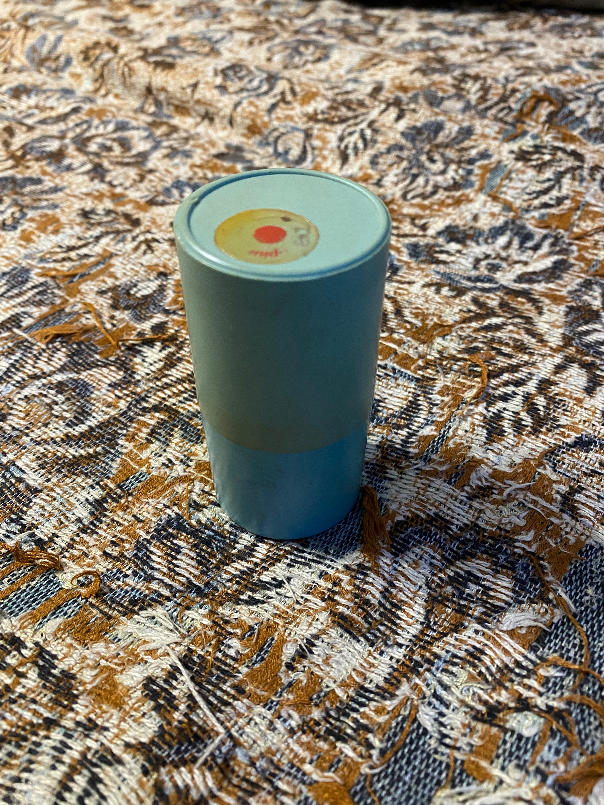
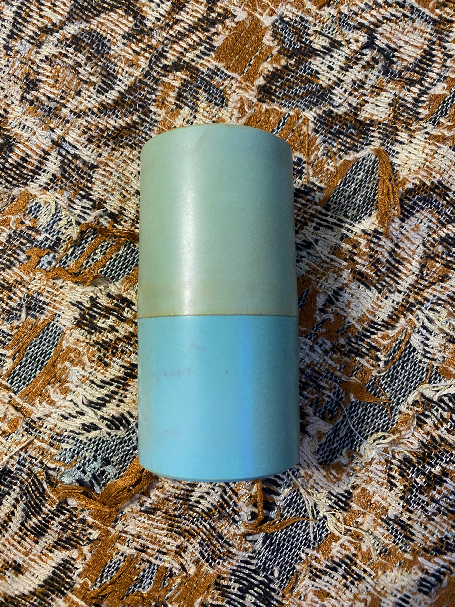
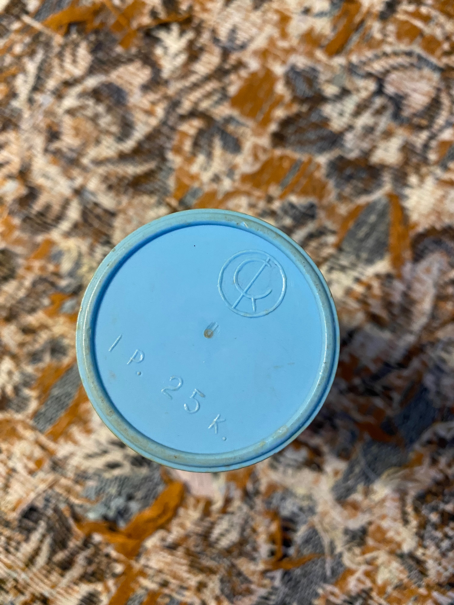
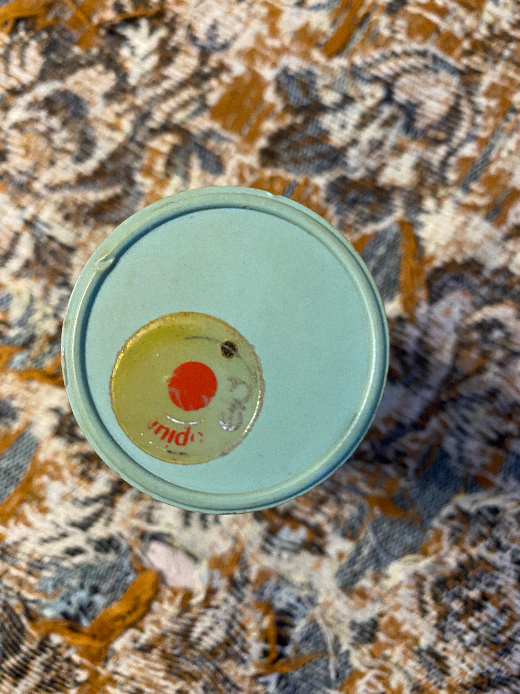
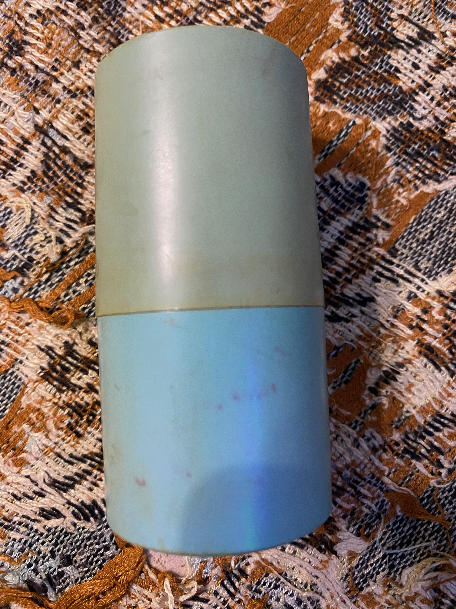

# Капсула

Капсула предварительно представляет собой футляр от школьных счетных палочек с неустановленной наклейкой сверху. Материал - пластик.

Наружний вид капсулы мало интересен так как надписи на нем были практически стерты и не поддавались идентификации. Зато внутреннее содержимое было превосходным.

