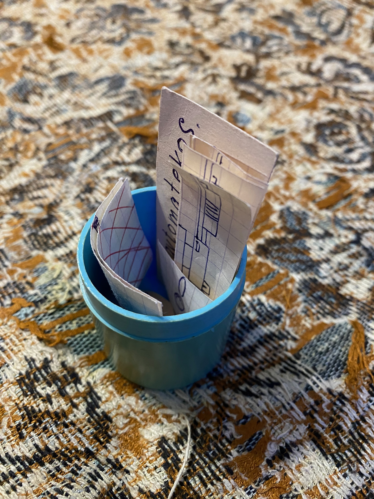

# Содержимое капсулы

При открытии капсулы было обнаружено:

* четыре помповых дробовика 
* вывеска фирмы Cats Avtomatekos
* гибкий диск 5" 
* кустарный пистолет неустановленного образца
* патент на имя Ежа Кукольного 

