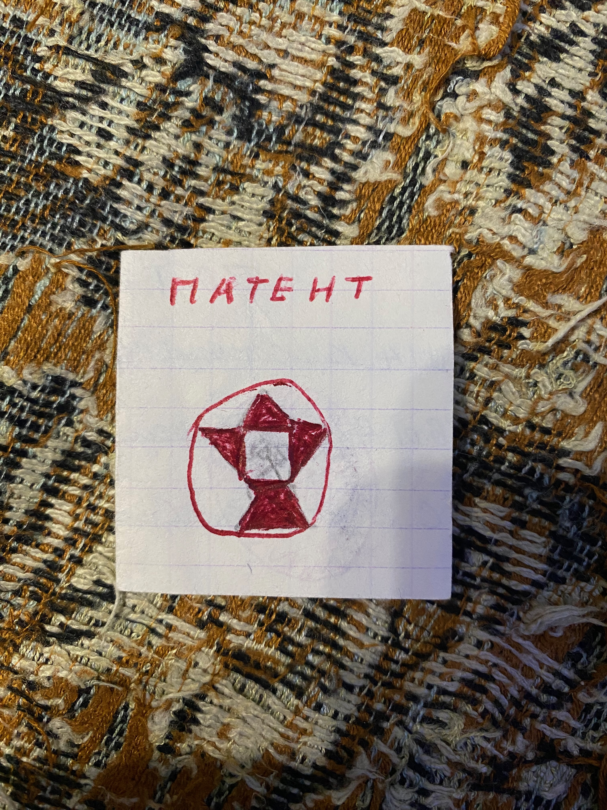
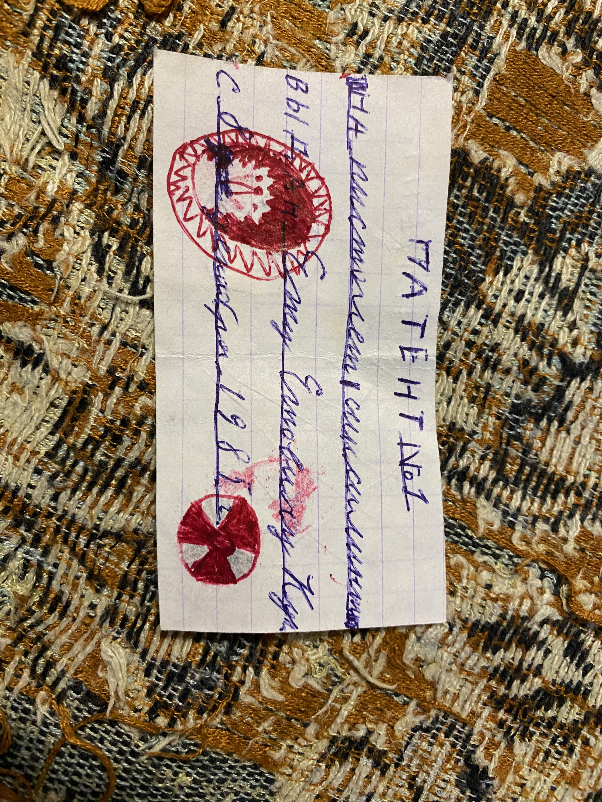
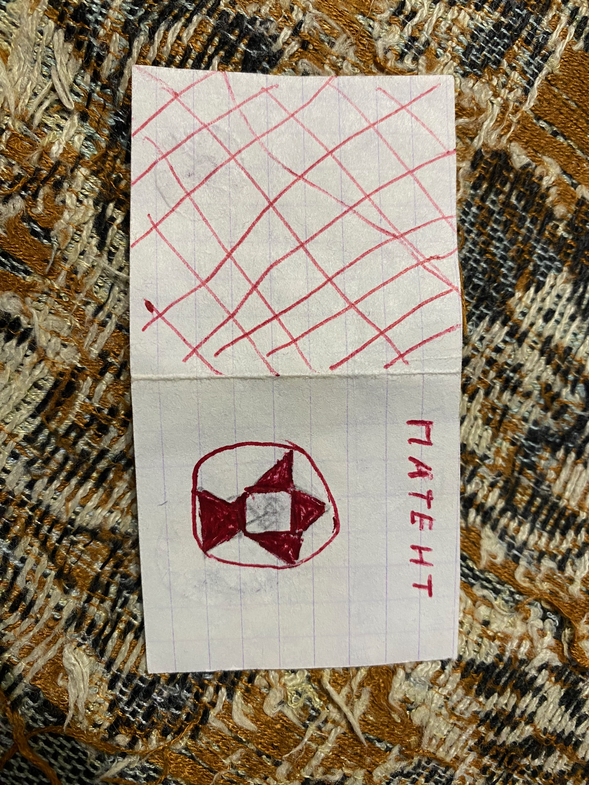

# Патент

Патент N1 Ежового союза, выдан на имя Ежа Ежовича Кукольного, на пистолет с сиксилитом.

"Сиксилит" - мифический взрывной порошок, "щепотки которого достаточно чтобы взорвать всю галатику". 

На основе данной находки совершенно точно можно сказать что 8 декабря 1985 года Ежовый союз определенно существовал.

Возможно, это был чей-то смелый эксперимент, на основе патента произвести и зарядить пистолет тем самым "сиксилитом", а в случае успеха еще и помповые ружья. К сожалению владельцев капсулы не сохранилось.