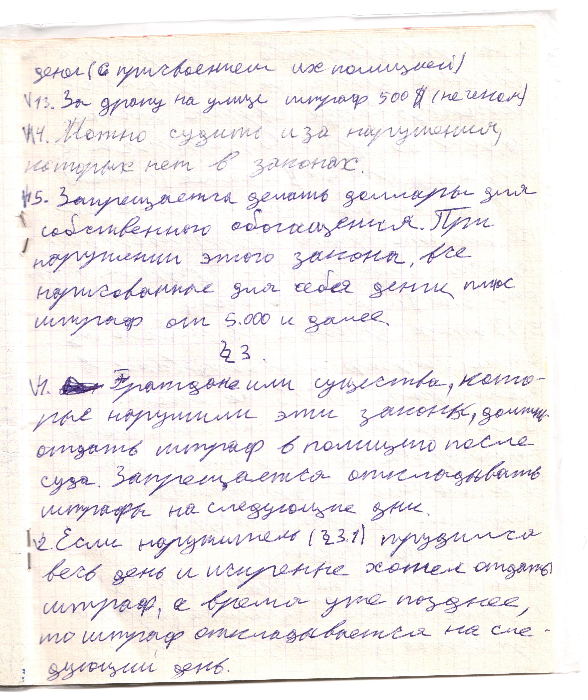

# Страница 13

денег (с присовоением их полицией)

13. За драку на улице шраф 500 \$ (не чеком)

14. Можно судить и за нарушения, которых нет в законах.

15. Запрещается делать доллары для собственного обогащения. При нарушении этого закона,  все нарисованные для себя деньги плю штраф от 5.000 и далее.

### Параграф 3

1. Граждане или существа, которые нарушили эти законы, должны отдать штраф в полицию после суда. Запрещается откладывать штрафы на следующие дни.

2. Если нарушитель (3.1) трудился весь день и искренне хотел отдать штраф, а время уже позднее, то штраф откладывается на следующий день.

