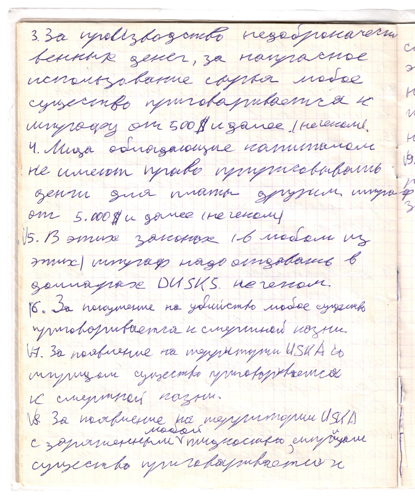

# Страница 14

3. За производство недоброкачественных денег, за напрасное использование сырья любое существо приговаривается к штрафу от 500 \$ и далее (не чеком)

4. Лица обладающие капиталом не имеют право пририсовывать деньги для платы другим, штраф от 5.000 \$ и далее (не чеком)

5. В этих законах (в любом из этих) штрф надо отдавать в долларах DUSKS не чеком.

6. За покушение на убийство любое существо приговаривается к смертной казни

7. За пояаление на территории USKA со шприцом существо приговаривается к смертной казни

8. За появление на территории USKA с заряженным любой жидкостью шприцом, существо приговаривается к

