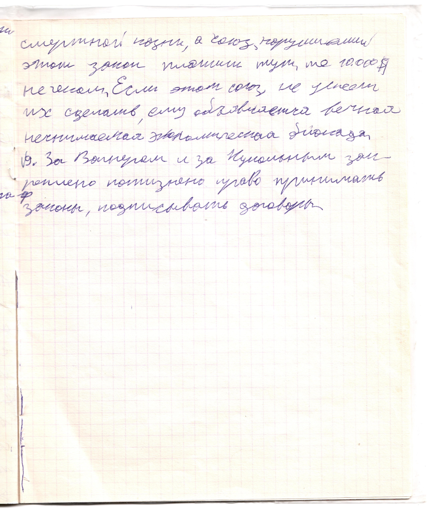

# Страница 15

смертной казни, а союз, нарушивший этот закон платит тут же 10.000 \$ не чеком. Если этот союз не успеет их сделать, ему обьявляется вечная неснимаемая экономическая блокада.

9. За Вагнером и Кукольным закреплено пожизненно право принимать законы, подписывать договоры.

