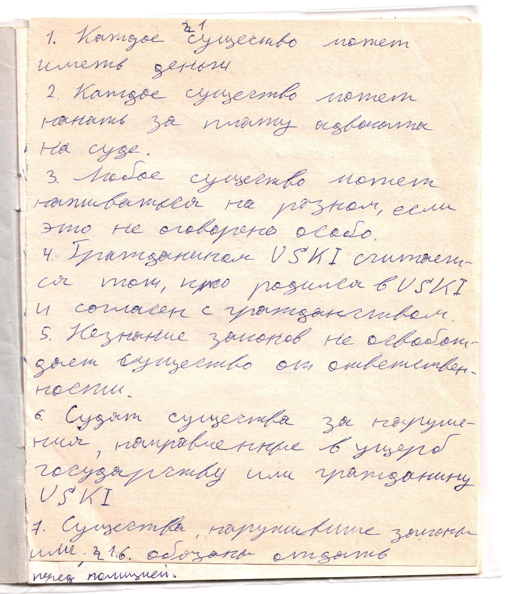

# Страница 3

### Параграф 1

1. Каждое существо может иметь деньги

2. Каждое существо может нанять за плату адвоката на суде.

3. Любое существо может наживаться на разном, если это не оговорено особо.

4. Гражданином USKI считается тот, кто родился в USKI и согласен с гражданством.

5. Незнание законов не освобождает существо от ответственности.

6. Судят существа за нарушения, направленные в ущерб государству или гражданину USKI

7. Существа, нарушившие законы или 1.6 обязаны отдать

