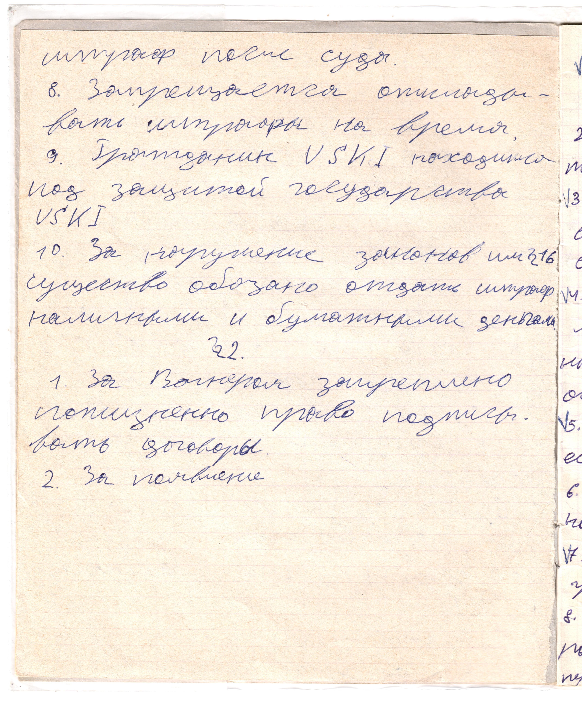

# Страница 4

штраф после суда.

8. Запрещается откладывать штрафы на время.

9. Гражданин USKI находится под защитой государства USKI

10. За нарушение законов или 1.6 существо обязано отдать штраф наличными и бумажными деньгами

### Параграф 2

1. За Вагнером закреплено пождизненно право подписывать договоры.

2. За появление

