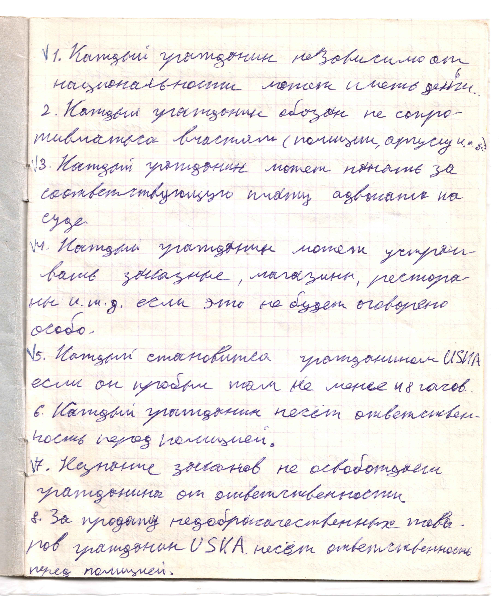

# Страница 5

1. Каждый гражданин независимо от национальности может иметь деньги.
2. Каждый граданин обязан не сопротивляться властям (полиции, аргусу, и.т.д.)
3. Каждый гражданин может нанять за соотвествующую плату адвоката на суде.
4. Каждый гражданин может устраивать заказные, магазины, рестораны и.т.д. если это не будет оговорено особо.
5. Каждый становится гражданином USDA если он пробыл там не менее 48 часов.
6. Каждый гражданин несет ответственность перед полицией.
7. Незнание законо не освобождает гражданина от ответственности
8. За продажу недоброкачественных товаров гражданин USKA несет ответственность перед полицией.

