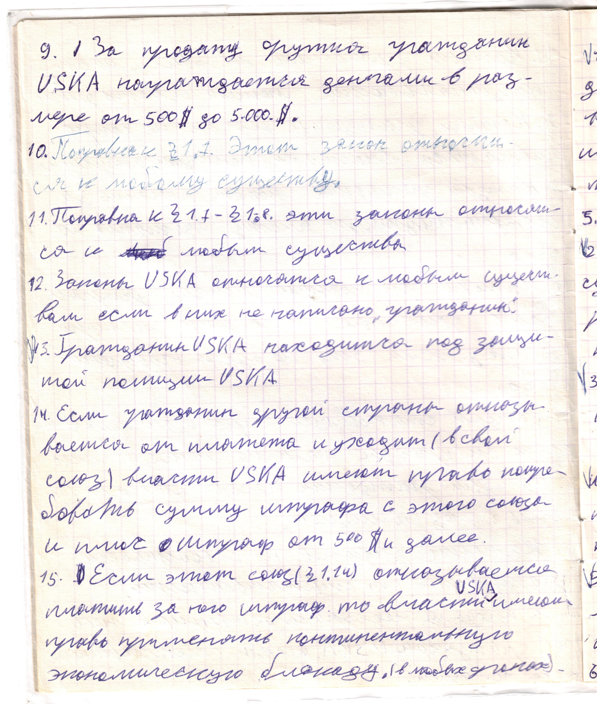

# Страница 6

9. За продажу оружия гражданин USKA награждается деньгами в размере от 500 \$ до 5.000 \$

10. Поправка к 1.7. Этот закон относится к любому существу.

11. Поправка к 1.7-1.8. Эти законы относятся к любым существам.

12. Законы USKA относятся к любомы существам, если в них не написано "гражданин"

13. Гражданин USKA находится под защитой полиции USKA

14. Если гражданин другой страны отказывается от платежа и уходит (в свой союз) власти USKA имеют право потребовать  сумму шрафа с этого союза и плю штраф от 500 \$ и далее.

15. Если этот союз (1.14) отказывается платить за него шраф, то власти USKA имеют право применять континентальную экономическую блокаду (в любых сроках).

16. 

