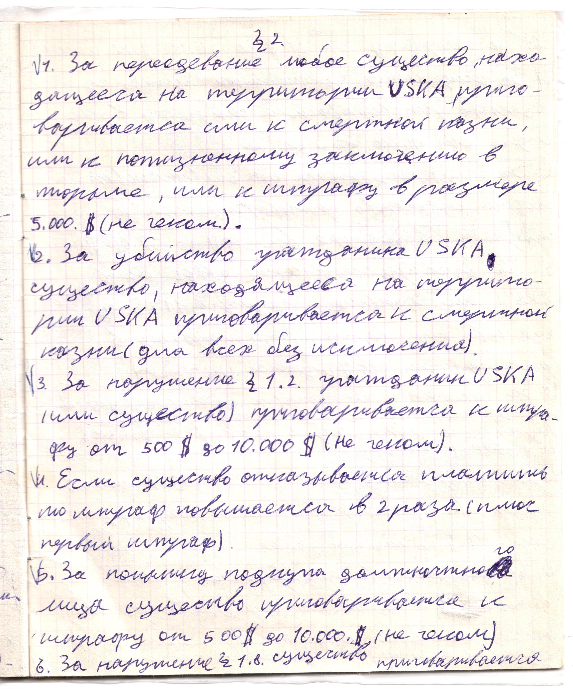

# Страница 7

## Параграф 2

1. За переодевание любое существо, находящееся на территории USKA приговаривается или к смертной казни, или к пожизненному заключению в тюрьме, или к штрафу в размере 5.000. \$ (не чеком).

2. За убийство гражданина USKA существо, находящееся на территории USKA приговаривается к смертной казни (для всех без исключения).

3. За нарушение 1.2. гражданин USKA (или существо) приговаривается к штрафу от 500 \$ до 10.000 \$ (не чеком).

4. Если существо отказывается платить, то штраф повышается в два раза (плюс первый штраф).

5. За попытку подкупа должностного лица существо приговаривается к штрафу от 500 \$ до 10.000 \$ (не чеком).

6. За нарушение 1.8 существо приговаривается 

