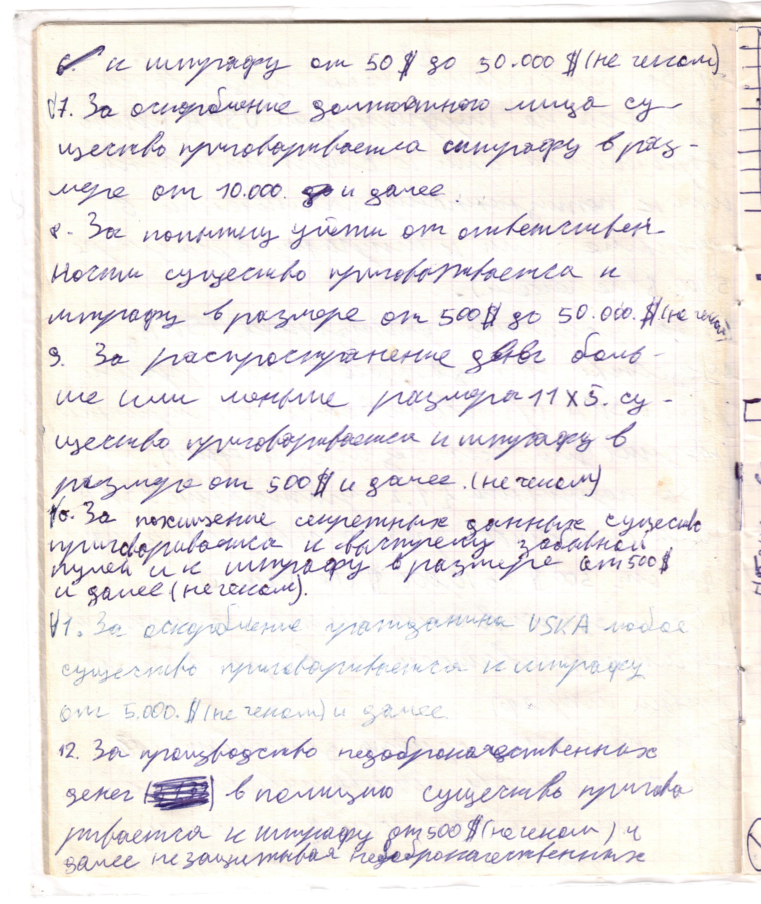

# Страница 8

к штрафу от 50 \$ до 50.000 \$ (не чеком).

7. За оскорбление должностного лица существо приговаривается к штрафу в размере от 10.000 и далее.

8. За попутыку уйти от ответственности существо приговаривается к штрафу в размере от 500 \$ до 50.000 \$ (не чеком).

9. За распространение денег больше или меньше размера 11 x 5 существо приговаривается к шртафу в размере от 500 \$ и далее (не чеком)

10. За похищение секретных данных существо приговаривается к выстрелу забываной пулей и к шртафу в размере от 500 \$ и далее (не чеком).

11. За оскорбление гражданина USKA любое существо приговаривается к штрафу от 5.000 \$ (не чеком) и далее

12. За производство недоброкачественных денег в полицию существо приговаривается к штрафу от 500 \$ (не чеком) и далее не защитывая недоброкачественных

