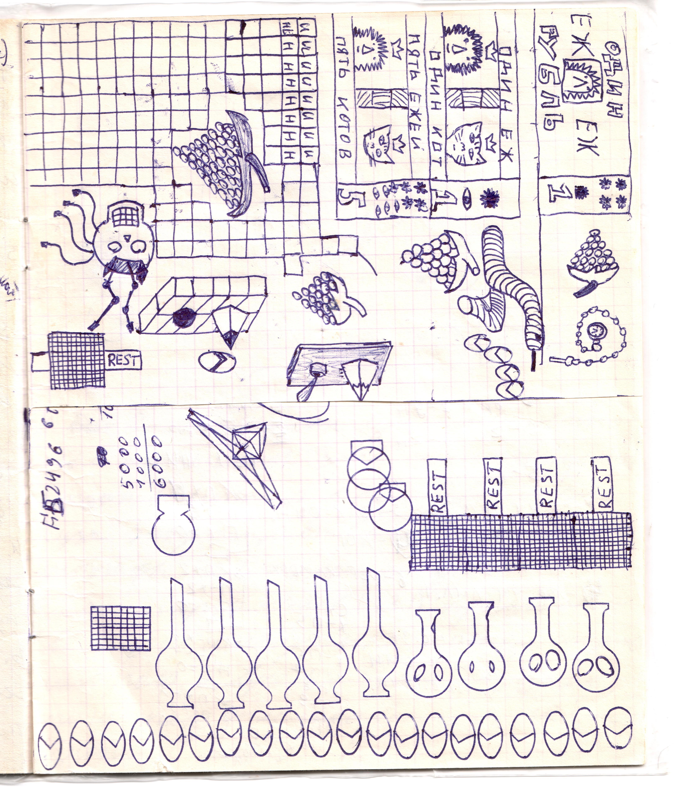

# Страница 9

Сохранилась половина листа. Содержит рисунки виноградных грозьдьев, проекты "переходных" денег, чернильницы, черепа-консоли (НЭМ, Вячеслав Назаров "Игра для смертных"), часов на цепочке, гравицап, хроноячеек для машини времени с надписью REST.

